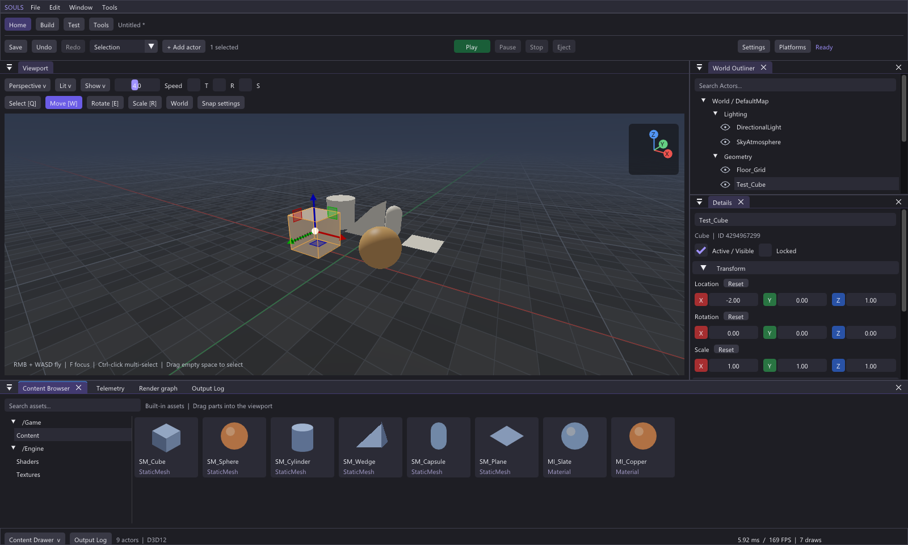

# Souls Engine

[](https://github.com/jamiejustcodes/Souls-Engine/actions/workflows/verify.yml)

Souls Engine is a C++23 game engine for Windows and Linux, built around explicit
graphics APIs and a dockable desktop editor. The current development milestone
is the interactive world-building editor: six built-in parts, viewport gizmos,
transactional undo/redo, level files, and live scene editing through Flecs.

Windows uses Direct3D 12 with the Agility SDK and enhanced barriers. Linux uses
Vulkan 1.3 with synchronization2 and dynamic rendering. The backend is selected at
compile time. Shared HLSL shaders compile to DXIL or SPIR-V during the build and
are embedded in the executable.



The editor brings together viewport navigation, actor selection, component
inspection, simulation controls, an asset browser, and measured frame telemetry.
This is an engine foundation under active development; the implemented scope and
remaining rendering work are described below.

## Build and run

Requires CMake 3.28+, Git, a C++23 standard library with `std::expected`, and a
capable GPU/driver. Windows x64: Visual Studio 2026 (included preset) or VS2022
17.10+. Linux x64: GCC14+ or Clang19+ with libstdc++14+, installed Vulkan loader
and SDL window-system development libraries. Configure fetches pinned SDL3,
Flecs, ImGui docking, ImPlot, ImGuizmo, Volk/Vulkan headers, Agility and DXC dependencies.

```powershell
cmake --preset windows -DSOULS_VULKAN_COMPILE_CHECK=ON
cmake --build --preset windows --parallel
ctest --preset windows --output-on-failure
.\build\windows\Debug\SoulsEditor.exe
.\build\windows\Debug\SoulsRuntime.exe
```

For VS2022 use `cmake -S . -B build/vs2022 -G "Visual Studio 17 2022" -A x64`,
then `cmake --build build/vs2022 --config Debug --parallel`.

```bash
# Ubuntu 24.04; install CMake >=3.28 separately if the distro version is older.
sudo apt-get install gcc-14 g++-14 ninja-build git libx11-dev libxext-dev \
  libxrandr-dev libxcursor-dev libxi-dev libxfixes-dev libxss-dev libxtst-dev \
  libxkbcommon-dev libvulkan1 mesa-vulkan-drivers vulkan-validationlayers xvfb
CC=gcc-14 CXX=g++-14 cmake --preset linux
cmake --build --preset linux --parallel
ctest --preset linux --output-on-failure
./build/linux/SoulsEditor
```

DXC 1.8.2505.32 is fetched automatically (Linux release v1.8.2505.1).
`SOULS_DXC=/absolute/path/to/dxc` overrides the Linux binary. Keep the deployed
`D3D12/` folder beside Windows executables. Enhanced-barrier support is required;
Linux requires Vulkan1.3, timeline semaphores, sync2, dynamic rendering and a
combined graphics/presentation queue. Unsupported devices return explicit errors.

## Editor controls

- Home/Build/Test/Tools tabs keep common actions above the UE-style docking
  workspace. Build exposes Cube, Sphere, Cylinder, Wedge, Capsule and Plane.
  Drag a part from Build or Content Browser onto the viewport. The wire preview
  snaps along the procedural floor and rests on its surface, including rotated
  or elevated floors. Double-click a mesh tile for placement at the world origin.
- RMB + WASD flies; Q/E rises/descends, Shift boosts, and wheel scales speed 1–8.
  F focuses the selection. Outside flight, Q/W/E/R selects Select/Move/Rotate/Scale
  while the viewport is hovered and text input is inactive.
- Click geometry or an Outliner row to select. Ctrl-click toggles; Shift-click
  adds. Drag empty viewport space to select visible, unlocked actor centers.
  All selected primitives receive an amber outline and shader highlight.
- Gizmos support local/world translation and rotation; scale follows local axes.
  T/R/S enable snapping, with editable steps in Snap settings (10 units, 15 degrees,
  0.25 by default). Group gizmos use a shared pivot; group scaling changes spacing
  and each actor's local scale without introducing shear. Escape cancels a drag.
- Details edits live XYZ, name, visibility, mesh, material, color and light values.
  Numeric multi-edit applies relative position, Euler rotation and scale to each
  selected actor. Axis buttons and Reset restore defaults. A complete drag or text
  edit is one undo operation. Locked parts remain inspectable and editable in
  metadata, but their transforms and deletion are protected.
- Ctrl+Z undoes; Ctrl+Y or Ctrl+Shift+Z redoes. History retains 64 operations.
  Ctrl+D duplicates selection; Delete removes it. Ctrl+G groups selection into a
  logical Outliner folder; double-click a group selects its members. Context menus
  expose Rename, Group/Ungroup and Lock/Unlock. Group transforms remain world-space.
- Ctrl+N creates a playground, Ctrl+O opens `.souls`, Ctrl+S saves, and
  Ctrl+Shift+S saves under a new name. Native dialogs choose files. Level saves use
  atomic replacement; invalid loads preserve the current world. Closing or replacing
  a dirty level presents Save/Discard/Cancel. A recovery level is updated every 60
  seconds while idle and dirty, under SDL's per-user SoulsEditor preference folder.
  Recovery opens as an unsaved level. Keeping recovery for the next launch pauses
  replacement snapshots until a level is saved. File failures display an error dialog.
  Smoke tests never touch user recovery files.
- Play runs primitive rotation simulation. Pause/Resume, Eject/Possess and Stop
  control it. Stop restores actors, selection and the edit-world history; temporary
  simulation changes never enter normal undo history. Editor documents hold 256
  actors; the underlying scene pool holds 4096.
- Content Browser, Telemetry, Render graph and Output Log share the bottom dock.
  Redock/detach tabs or toggle panels from Window. Frame budget defaults to
  60 Hz / 16.67 ms and can switch to 144 Hz / 6.94 ms. CPU timing includes waits;
  GPU time and draw counts come from the renderer. The console accepts `help`,
  `clear`, `reset`, `cube`, `sphere`.

The minimum window size is 1100×720 at 100% DPI and scales with DPI. Offscreen
viewports resize after retirement; minimized windows suspend rendering. Detached
panel close stays local. Landscape and Modeling mode labels reserve workspace
roles; sculpting and topology tools remain future work.

## Rendering and memory contracts

`SoulsCore`, `SoulsScene`, `SoulsRHI`, `SoulsRenderer`, `SoulsRuntime` and
`SoulsEditor`, `SoulsEditorDocument` and `SoulsEditorTools` have separate targets and headers. No runtime backend vtable or
exceptions exist in engine code. Native graphics APIs retain their own dispatch.
Generation-indexed buffers, textures and pipelines reject stale handles. Resource
creation/destruction is cold-path work; command tokens expire after submission.

Vertex/index uploads stage into device-local buffers and retire before releasing
staging storage. Persistent per-frame mapped constants are written only after the
slot fence/timeline completes. A 256-byte shared camera/light/grid/sky block and
96-byte object constants feed indexed primitive draws and a full-screen analytic
floor pass. Each offscreen target owns RGBA8 color and D32 depth. Selection is
CPU ray versus each transformed primitive shape; normal transforms support nonuniform
scale. World Z is up; matrices use column vectors and depth range [0,1].

Flecs stores position, rotation, scale and bounds as scalar columns. Extraction
writes contiguous SoA arrays in a 512KiB frame arena; the renderer consumes them
without heap allocation. Structural actor edits happen before frame recording.
Third-party ImGui, SDL and driver allocations are outside this engine-core guard.
The floor is infinite, checkered, pixel-filtered and fogged; floor transforms are
live. Lighting is Blinn-Phong with tone mapping, and sky color is procedural.
Lux is normalized to a reference sun intensity for this initial shading pass;
this is not a calibrated physical exposure pipeline. Shadows, deferred GBuffer,
asset import, shader authoring and GPU-driven indirect draws
are subsequent stages. A future orthographic/batching renderer stays separate.

## Verification

```powershell
cmake --preset windows-asan -DSOULS_VULKAN_COMPILE_CHECK=ON
cmake --build --preset windows-asan --parallel
ctest --test-dir build/windows-asan -C Debug --output-on-failure
.\build\windows\Debug\SoulsEditor.exe --validation --smoke 120
.\build\windows\Debug\SoulsRuntime.exe --validation --smoke 120
# Direct GPU readback, independent of desktop occlusion:
.\tools\CaptureEditor.ps1
# Dependency-free core build:
cmake --preset core
cmake --build --preset core
ctest --preset core
```

```bash
cmake --preset linux-sanitize
cmake --build --preset linux-sanitize --parallel
ctest --preset linux-sanitize -LE 'gpu|interactive'
ASAN_OPTIONS=detect_leaks=0 xvfb-run -a ./build/linux-sanitize/SoulsEditor --validation --smoke 120
ASAN_OPTIONS=detect_leaks=0 xvfb-run -a ./build/linux-sanitize/SoulsRuntime --validation --smoke 120
```

`--smoke N` (N>=90) drives narrow/wide resize transitions and exits nonzero on
failures. The editor additionally tests simulation restore, selected actor edits,
duplicate/delete and stale texture/buffer/pipeline handles and command tokens.
Scene contracts cover all six primitive shapes, visibility, locks, groups, SoA
values and camera projection. Document tests cover history branching, dirty state,
Unicode paths, malformed files, capacity limits, recovery and simulation isolation.
Headless ImGuizmo tests drive real mouse gestures for move, rotate and scale with
the engine camera; transform tests cover mirrored TRS and floor placement. The allocation harness measures 2000 live edits
and extractions. `--capture path.bmp` reads frame90 through the RHI. Windows exports the main
editor composite; Vulkan exports the last offscreen scene color, avoiding access
to presentation-owned images. Windows compile-check targets include Vulkan
C++ and SPIR-V shaders plus an optional `SoulsVulkanRuntimeCheck` GPU smoke.
This exercises Vulkan on Windows and does not substitute for a Linux GPU run. See
[VERIFICATION.md](VERIFICATION.md) for local evidence and the manual QA checklist.

## Source map

| Subsystem | Complete implementation |
|---|---|
| RHI interface and constants | [SoulsRHI.hpp](include/souls/rhi/SoulsRHI.hpp) |
| D3D12 backend and uploads/draws | [D3D12.cpp](src/rhi/D3D12.cpp), [D3D12Geometry.inl](src/rhi/D3D12Geometry.inl) |
| Vulkan backend and uploads/draws | [Vulkan.cpp](src/rhi/Vulkan.cpp), [VulkanGeometry.inl](src/rhi/VulkanGeometry.inl) |
| Mesh generation and scene pass | [Renderer.cpp](src/renderer/Renderer.cpp), [Playground.hlsl](shaders/Playground.hlsl) |
| Flecs world and SoA extraction | [Scene.cpp](src/scene/Scene.cpp), [Scene.hpp](include/souls/scene/Scene.hpp) |
| Camera and matrix math | [Math.hpp](include/souls/core/Math.hpp) |
| Editor shell, theme and docks | [main.cpp](src/editor/main.cpp), [Workspace.cpp](src/editor/Workspace.cpp) |
| Document history and level persistence | [EditorDocument.hpp](include/souls/editor/EditorDocument.hpp), [EditorDocument.cpp](src/editor/EditorDocument.cpp) |
| Gizmos, selection and placement | [WorkspaceViewport.cpp](src/editor/WorkspaceViewport.cpp), [TransformTools.cpp](src/editor/TransformTools.cpp) |
| Native files and recovery | [WorkspaceFiles.cpp](src/editor/WorkspaceFiles.cpp), [FileDialogs.cpp](src/editor/FileDialogs.cpp) |
| Outliner, Details, assets and console | [WorkspaceActors.cpp](src/editor/WorkspaceActors.cpp) |
| Build and shader compilation | [CMakeLists.txt](CMakeLists.txt), [Shaders.cmake](cmake/Shaders.cmake), [EmbedShaders.cmake](cmake/EmbedShaders.cmake) |

Development conventions are in [CONTRIBUTING.md](CONTRIBUTING.md). The editor's
workspace and visual rules are documented in [DESIGN.md](DESIGN.md), with project
constraints in [PRODUCT.md](PRODUCT.md).

ImGuizmo is pinned to a reviewed commit and built only for its transform widget.
Third-party licenses remain with their fetched sources; see the
[ImGuizmo project](https://github.com/CedricGuillemet/ImGuizmo).
